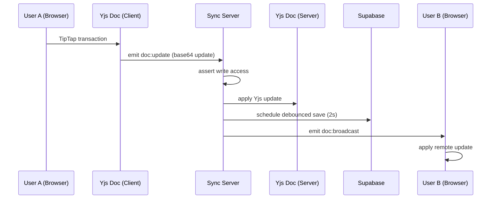
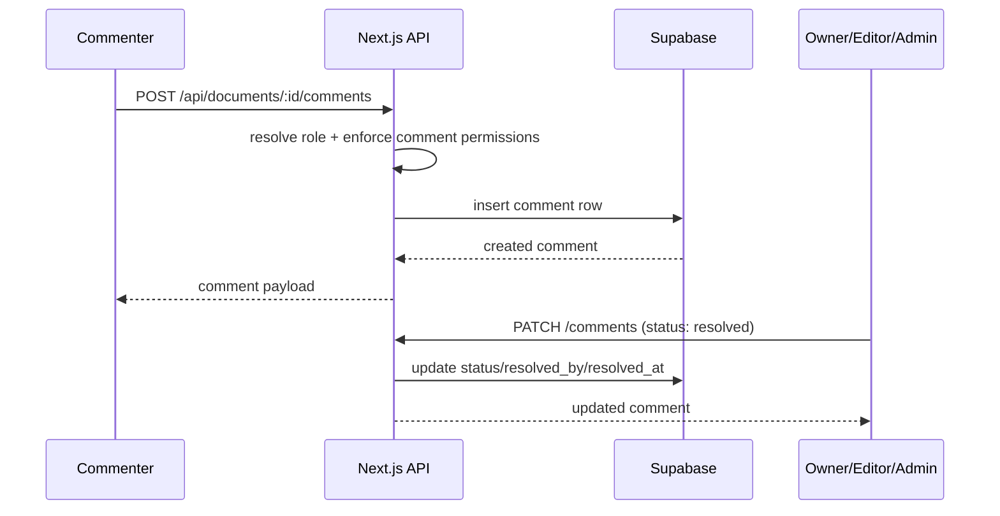
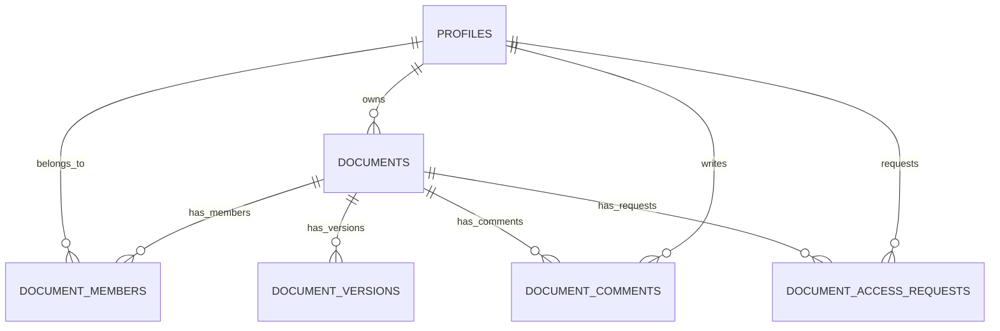

# Lumina Write

Real-time collaborative text editor built for GUVI Hackathon (Track 1).

## Live Demo

https://lumina-write-editor.vercel.app/

## Demo Video

(Add your demo video link here)

- Track: Real-time Collaborative Text Editor
- Role: Full-stack developer
- Monorepo: `apps/web` + `apps/sync-server`
- Live app: https://lumina-write-editor.vercel.app/

---

## 1. Product Overview

Lumina Write is a Google Docs-style collaborative editor where multiple users can:

- Create and manage documents
- Share with role-based permissions
- Co-edit in real time with CRDT synchronization
- View collaborator presence and cursor colors
- Request access to private documents
- Save and restore version snapshots
- Review with a full comment workflow (`commenter` role is now active)

### Key capabilities

- Authentication: Supabase Auth (Google OAuth + email/password)
- Collaboration: Yjs CRDT + Socket.IO sync server
- Authorization: PostgreSQL + Row Level Security (RLS)
- Permissions: `owner`, `admin`, `editor`, `commenter`, `viewer`
- Persistence: debounced Yjs state save (2s) to PostgreSQL

---

## 2. High-Level Architecture

```mermaid
graph TB
    subgraph Frontend (Vercel)
        A[Next.js 14 App Router]
        B[TipTap editor / ProseMirror]
        C[Yjs Doc in browser]
    end

    subgraph Sync Server (Render)
        D[Express + Socket.IO]
        E[In-memory Yjs Doc manager]
    end

    subgraph Supabase
        F[Auth]
        G[PostgreSQL]
        H[RLS + SECURITY DEFINER helpers]
    end

    A -->|Route Handlers| G
    A -->|OAuth callback| F
    B --> C
    C -->|doc:update / doc:broadcast| D
    D --> E
    E -->|2s debounced persist| G
    D -->|JWT verification| F
    D -->|Document access checks| G
```

### Data flow (user types a character)



### Data flow (comment workflow)



---

## 3. Tech Stack

| Layer | Technology | Why |
| --- | --- | --- |
| Frontend | Next.js 14, React 18, TypeScript | App Router + API routes + typed code |
| Editor | TipTap v2 (ProseMirror) | Extensible rich text editor |
| Realtime | Yjs | Conflict-free CRDT merging |
| Transport | Socket.IO | Rooms, reconnects, fallback transports |
| Backend data/auth | Supabase (PostgreSQL + Auth) | OAuth + SQL + RLS |
| Styling | Tailwind CSS | Fast UI iteration |
| Notifications | react-hot-toast | Lightweight user feedback |
| Deploy | Vercel (web), Render (sync server) | Good fit for this split architecture |
| Monorepo | npm workspaces | Shared deps across apps |

---

## 4. Monorepo Structure

```plaintext
.
|-- apps/
|   |-- sync-server/
|   |   `-- src/
|   |       |-- index.ts
|   |       |-- auth.ts
|   |       `-- yjsManager.ts
|   `-- web/
|       `-- src/
|           |-- app/
|           |   |-- api/
|           |   |-- login/
|           |   |-- doc/[id]/
|           |   |-- auth/callback/
|           |   |-- layout.tsx
|           |   `-- page.tsx
|           |-- components/
|           |   |-- Editor.tsx
|           |   |-- CommentsPanel.tsx
|           |   |-- ShareModal.tsx
|           |   |-- VersionHistoryPanel.tsx
|           |   |-- PresenceBar.tsx
|           |   `-- editorExtensions.ts
|           |-- hooks/
|           |   `-- useCollabEditor.ts
|           `-- lib/
|               |-- supabase/
|               |-- base64.ts
|               |-- cursorColors.ts
|               |-- http.ts
|               `-- notify.ts
|-- supabase/
|   |-- schema.sql
|   `-- patches/
|       |-- add_admin_role.sql
|       |-- fix_document_members_rls.sql
|       `-- add_document_comments.sql
|-- package.json
`-- .env.example
```

---

## 5. API Surface

### Web API routes (`apps/web/src/app/api`)

| Route | Methods | Purpose |
| --- | --- | --- |
| `/api/documents` | `GET`, `POST` | List and create documents |
| `/api/documents/[id]/access` | `GET`, `POST`, `PATCH` | Access state + request/approve flow |
| `/api/documents/[id]/share` | `GET`, `POST`, `PATCH`, `DELETE` | Invite/update/revoke collaborators |
| `/api/documents/[id]/versions` | `GET`, `POST` | Version history snapshots |
| `/api/documents/[id]/comments` | `GET`, `POST`, `PATCH`, `DELETE` | Comment list/create/edit/resolve/delete |
| `/api/users/search` | `GET` | User lookup for sharing |

### Sync events (`apps/sync-server/src/index.ts`)

- `doc:join`
- `doc:load`
- `doc:update`
- `doc:broadcast`
- `awareness:update`
- `awareness:sync`
- `awareness:diff`
- `doc:rejected`

---

## 6. Database Schema

Core tables:

- `profiles`
- `documents`
- `document_members`
- `document_versions`
- `document_comments`
- `document_access_requests`



### RLS recursion fix (important design decision)

Naive policies on `documents` and `document_members` can recurse infinitely.

This repo uses `SECURITY DEFINER` helper functions in `supabase/schema.sql`:

- `is_document_member(doc_id)`
- `is_document_owner(doc_id)`

These helpers break the circular policy dependency.

---

## 7. Permission Matrix

| Capability | owner | admin | editor | commenter | viewer |
| --- | --- | --- | --- | --- | --- |
| Open document | Yes | Yes | Yes | Yes | Yes |
| Edit document body | Yes | Yes | Yes | No | No |
| See live presence/cursors | Yes | Yes | Yes | Yes | Yes |
| Create comment | Yes | Yes | Yes | Yes | No |
| Resolve comment | Yes | Yes | Yes | Yes | No |
| Reopen comment | Yes | Yes | Yes | Own comment | No |
| Edit own open comment | Yes | Yes | Yes | Yes | No |
| Delete comment | Yes | Yes | Yes | Own comment | No |
| Open share modal + manage members | Yes | No | No | No | No |
| Approve access requests | Yes | No | No | No | No |

### Notes

- Share/member management is intentionally owner-only in current API handlers.
- `commenter` can fully participate in review, while document text remains read-only.

---

## 8. Comment Workflow (Implemented)

The `commenter` role is now fully operational through the `document_comments` workflow:

- Comments panel in editor UI
- Add comment with optional selected-text preview
- Edit own open comment
- Resolve/reopen comments by role
- Delete rules (owner/admin/editor or author)
- Server-side role checks in `/api/documents/[id]/comments`

### Main files

- `apps/web/src/components/CommentsPanel.tsx`
- `apps/web/src/app/api/documents/[id]/comments/route.ts`
- `supabase/schema.sql` (`document_comments` table + policies)
- `supabase/patches/add_document_comments.sql`

---

## 9. Local Setup

### Prerequisites

- Node.js 18+
- npm
- Supabase project

### Install

```bash
git clone https://github.com/Sudhan1112/Lumina-Write-editor.git
cd Lumina-Write-editor
npm install
```

### Environment

```bash
cp .env.example apps/web/.env.local
cp .env.example apps/sync-server/.env
```

`apps/web/.env.local`

```env
NEXT_PUBLIC_SUPABASE_URL=https://<project>.supabase.co
NEXT_PUBLIC_SUPABASE_ANON_KEY=<anon-key>
SUPABASE_SERVICE_KEY=<service-role-key>
NEXT_PUBLIC_SYNC_SERVER_URL=http://localhost:4000
```

`apps/sync-server/.env`

```env
SUPABASE_URL=https://<project>.supabase.co
SUPABASE_SERVICE_KEY=<service-role-key>
PORT=4000
CLIENT_URL=http://localhost:3000
```

### Database setup

1. Run `supabase/schema.sql` on a fresh project.
2. For existing projects, run patches:

```plaintext
supabase/patches/add_admin_role.sql
supabase/patches/fix_document_members_rls.sql
supabase/patches/add_document_comments.sql
```

### Run locally

```bash
npm run dev --workspace=apps/sync-server
npm run dev --workspace=apps/web
```

- Web: `http://localhost:3000`
- Sync server: `http://localhost:4000`

---

## 10. Developer Scripts

From repo root:

```bash
npm run dev:web
npm run dev:server
npm run dev:all
npm run build:web
npm run build:server
```

Web workspace only:

```bash
npm run lint --workspace=apps/web
npm run build --workspace=apps/web
```

---

## 11. End-to-End Product Story

1. User signs in (Google OAuth or email/password).
2. Dashboard fetches owned + shared docs via `/api/documents`.
3. User creates a doc and enters `/doc/[id]`.
4. Editor initializes TipTap + Yjs + Socket.IO connection.
5. Sync server verifies JWT, checks document access, joins room.
6. Typing emits Yjs updates, server rebroadcasts, DB persists state (2s debounce).
7. Owner shares doc and assigns role.
8. Collaborators join and see live cursors/presence.
9. Reviewers add comments in the comments panel.
10. Team resolves/reopens comments while continuing collaborative writing.

---

## 12. Demo Script (5 minutes)

| Time | Action | Suggested narration |
| --- | --- | --- |
| 0:00 | Open app | "Lumina Write is a real-time collaborative editor with role-based access." |
| 0:30 | Login | "Supabase handles OAuth and sessions." |
| 1:00 | Dashboard | "I can create docs or start from templates." |
| 1:30 | Open document | "This is the collaborative editor with presence and versioning." |
| 2:00 | Open second user | "Now I join from another account." |
| 2:30 | Live typing | "Both users edit simultaneously; Yjs merges conflicts automatically." |
| 3:30 | Share modal | "Owner can invite users and assign roles." |
| 4:00 | Comments panel | "Commenter can review without editing body text." |
| 4:30 | Version history | "I can save and restore snapshots." |
| 5:00 | Wrap-up | "Architecture: Next.js + Socket.IO + Yjs + Supabase RLS." |

---

## 13. Demo Readiness Checklist

- [ ] Deployed app opens without console errors
- [ ] Google OAuth works end to end
- [ ] Create/rename/delete document flow works
- [ ] Share flow works for all roles
- [ ] Commenter can add/resolve/reopen comments
- [ ] Viewer is read-only for body and comments
- [ ] Live collaboration works in two browser sessions
- [ ] Version snapshots save and restore correctly
- [ ] Missing document route shows graceful error
- [ ] Backup screen recording is ready

---

## 14. Current Trade-offs

- Sync docs are cached in memory on sync server and persisted with debounce.
- Socket update rate limiting is not yet implemented.
- Some large components (`Editor.tsx`, dashboard page) can still be split further.
- The full repository lint still reports pre-existing issues in unrelated files.

---

## 15. Interview Talking Points

### Why Yjs + Socket.IO?

- Yjs gives deterministic CRDT convergence under concurrent edits.
- Socket.IO gives rooms, reconnection, middleware auth, and transport fallbacks.

### Hardest DB challenge

- RLS recursion between `documents` and `document_members`.
- Solved with `SECURITY DEFINER` helper functions.

### What happens during network loss?

- Socket reconnect logic restores room state.
- Local editing state remains in Yjs and syncs after reconnect.

### How to scale this architecture

- Add Redis adapter for Socket.IO pub/sub.
- Horizontally scale sync servers behind sticky sessions.
- Add API/socket rate limiting and DB performance indexes.

---

## 16. Security Notes

- Keep service-role keys server-only.
- Never expose `SUPABASE_SERVICE_KEY` in client bundles.
- API routes always verify authenticated user before privileged actions.
- RLS remains active for direct client table access.

---
