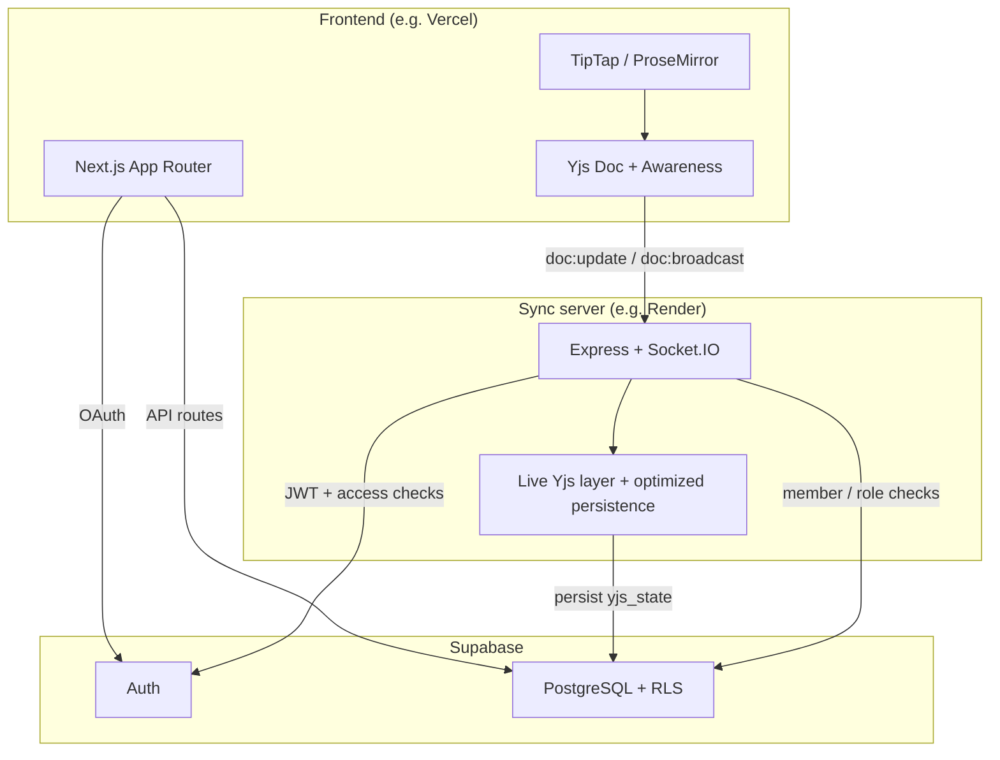
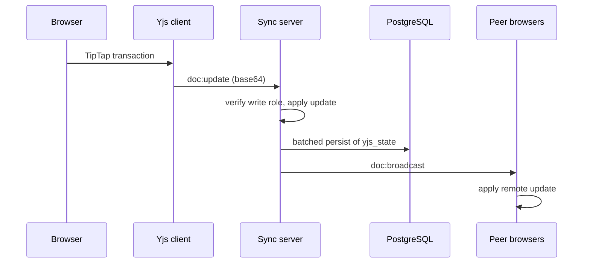
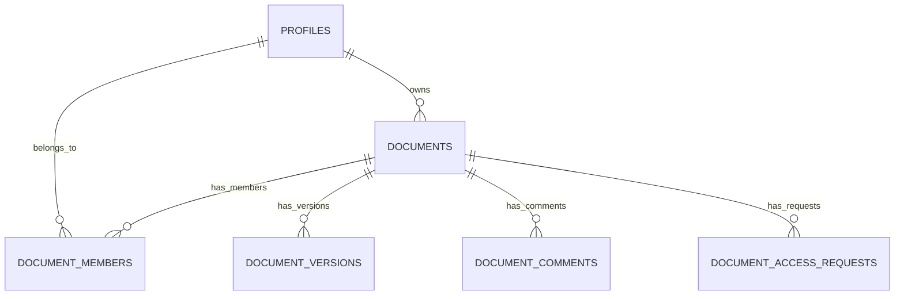

# Lumina Write

## What is Lumina Write?

**Lumina Write is a Google Docs–style collaborative editor for the web:** you and your teammates edit the same document at the same time, see who is online, and discuss the text with comments. You sign in, create or open a doc, share it with the right permissions, and start writing—nothing to install.

---

## Why is this interesting?

**Real-time collaboration is hard.** If two people edit the same paragraph at once, a naive app can scramble text, lose someone’s work, or show different versions to different people.

**This project tackles that head-on.** It keeps a single shared copy of each document **in sync across everyone’s screens** as fast as the network allows. Under the hood it uses a **CRDT** (a structured way to merge edits so conflicts resolve predictably) and a **dedicated realtime channel** so typing, presence, and saved state stay aligned—not “email the file back and forth,” but **live co-editing** with roles and permissions layered on top.

---

## How it works (simple idea)

Picture **one shared notebook** that everyone is looking at. When you add a sentence, that change is sent through a **coordinator** (the app and sync service) so the same words appear for your teammates—and when they type, you see it too. The notebook also **saves to durable storage** so the document is still there when you come back later. The sections below explain how that idea maps to code, servers, and the database.

---

Real-time collaborative rich-text editor: Next.js + TipTap, **Yjs CRDT** over Socket.IO, Supabase Auth, and PostgreSQL with Row Level Security.

**Live app:** https://lumina-write-editor.vercel.app/

### Why this stack (high level)

- **Real-time, conflict-free editing** — Yjs CRDT merges concurrent changes deterministically; great for live collaboration.
- **Secure by design** — Multi-layer access control: authenticated API routes and **Supabase RLS** aligned with app rules.
- **Modular, scalability-ready architecture** — Web app and dedicated realtime **sync service** separate concerns; clear path to horizontal scaling with a shared sync layer when you need it.

---

## What you can do

- Sign in (Supabase: Google OAuth or email/password).
- Create documents, share them with roles, request access to private docs.
- Co-edit in real time with presence and cursor colors.
- Comment, resolve, and manage comments by role.
- Save and restore version snapshots.

---

## How it works (flows for contributors)

These paths are the fastest way to navigate the codebase.

### 1. Opening a document and connecting to live sync

1. User opens `/doc/[id]` (`apps/web/src/app/doc/[id]/page.tsx`).
2. The page uses **`useCollabEditor`** (`apps/web/src/hooks/useCollabEditor.ts`): creates a **`Y.Doc`** and **`Awareness`** (presence/cursors).
3. The hook opens a Socket.IO client to `NEXT_PUBLIC_SYNC_SERVER_URL`, passing the Supabase **`access_token`** in `auth.token`.
4. On **`connect`**, the client emits **`doc:join`** with the document id.
5. The sync server (`apps/sync-server/src/index.ts`) verifies the user in **`io.use`**, checks membership with **`assertDocumentAccess`**, joins the Socket.IO room, then:
   - Loads or creates the server-side Yjs doc via **`getOrCreateDoc`** (`apps/sync-server/src/yjsManager.ts`) — seeded from **`documents.yjs_state`** in Postgres if present.
   - Emits **`doc:load`** (full state as base64) to that client.
   - Sends **`awareness:sync`** so presence can align.
6. The client applies **`doc:load`** with `Y.applyUpdate(..., 'remote')` so TipTap stays in sync with the server’s canonical doc.

**Rejection path:** if the user cannot access the document, the server emits **`doc:rejected`**; the hook surfaces **`syncRejectMessage`** and stops treating the session as connected.

### 2. Typing and persisting the document body

1. TipTap edits mutate the shared **`Y.Doc`**.
2. Local Yjs updates (non-remote origin) are sent as **`doc:update`** with a base64-encoded update.
3. The server **`resolveSocketAccess`** requires a **write** role (`owner`, `admin`, `editor`), applies the update with **`Y.applyUpdate`**, **`schedulePersist`**, and broadcasts **`doc:broadcast`** to everyone else in the room.
4. **`schedulePersist`** batches writes on a short interval and persists **`documents.yjs_state`** via the Supabase service role (`yjsManager.ts`)—an **optimized persistence strategy** that keeps collaboration responsive with minimal latency.

Comments, sharing, and version rows are **not** carried on this socket path; only the Yjs document state is.

### 3. Presence (cursors / who’s online)

1. Awareness changes from the local client emit **`awareness:update`**.
2. The server echoes **`awareness:diff`** to peers; **`applyAwarenessUpdate`** runs on the client.
3. Cursor colors are chosen in **`useCollabEditor`** using **`cursorColors.ts`** to reduce collisions.

### 4. REST API vs realtime

| Concern | Where it lives |
| --- | --- |
| Document list, create, share, access requests, versions, comments | Next.js **Route Handlers** under `apps/web/src/app/api/` → Supabase (RLS + server checks). |
| Live body text + presence | **Yjs + Socket.IO** on `apps/sync-server` as above. |

Main editor UI: **`Editor.tsx`**. Comment UI and API: **`CommentsPanel.tsx`**, **`/api/documents/[id]/comments`**.

---

## Architecture



### Sequence: one edit propagates



---

## Tech stack

| Layer | Stack |
| --- | --- |
| App | Next.js 14, React 18, TypeScript, Tailwind |
| Editor | TipTap v2 (ProseMirror) |
| CRDT | Yjs |
| Realtime transport | Socket.IO |
| Data & auth | Supabase (Postgres, Auth, RLS) |
| Monorepo | npm workspaces (`apps/web`, `apps/sync-server`) |

---

## AI tools and how they were used

This project leaned on several AI assistants during planning, design, and implementation. The notes below are for transparency with collaborators and future maintainers.

### ChatGPT and Claude (planning and architecture)

Used for **early project planning** and **architecture design**, including **efficient** use of Supabase, Vercel, and Render so requests and responses flow smoothly end to end.

That work included brainstorming **what features** could make the platform stronger and more distinctive, the **tradeoffs** of adding each idea, high-level **architecture**, **schemas**, and **data flow** (client → app/server → backend services → database): what should be **stored**, how it should be **retrieved**, and how pieces connect end to end.

### Stitch (UI design) and Cursor MCP

**Stitch** was used to generate **frontend layouts and design directions**. The UI **typography and color direction** take inspiration from **Anthropic’s** design language: a **single, balanced palette** that reads well in **daytime and nighttime** use without forcing a separate “dark mode vs light mode” build—one subtle theme that stays easy on the eyes.

The **Stitch MCP** was connected **inside Cursor** so design ideas could feed directly into building the frontend in the editor.

### Codex (VS Code / CLI agent) and integration

The **OpenAI Codex** CLI agent (in VS Code) was used to help **implement the backend end to end** and **wire the frontend to the backend** (APIs, sync server, and app integration).

### Where it runs

| Piece | Host |
| --- | --- |
| Frontend (Next.js app) | **Vercel** |
| Backend (realtime sync server) | **Render** |
| Database (SQL, auth, RLS) | **Supabase** |

### Deployment and operations

Frontend and sync services are deployed for **cost-efficient scaling** (e.g. Vercel + Render). A **health-check schedule** (external cron hitting `/health`) helps keep services responsive under typical load. Production hardening can add dedicated instances, autoscaling, and monitoring as traffic grows.

---

## Repository layout

```plaintext
.
├── package.json                 # npm workspaces; scripts: dev:web, dev:server, dev:all, build:*
├── package-lock.json            # locked installs
├── README.md                    # project docs (this file)
├── vercel.json                  # Vercel: framework nextjs
├── .env.example                 # copy → apps/web/.env.local & apps/sync-server/.env
│
├── apps/
│   ├── web/                     # Next.js 14 frontend (deploy: Vercel)
│   │   ├── package.json
│   │   ├── next.config.mjs      # Next.js config
│   │   ├── tailwind.config.ts   # Tailwind theme / paths
│   │   ├── postcss.config.mjs
│   │   ├── tsconfig.json        # TS + @/* paths
│   │   ├── next-env.d.ts
│   │   ├── components.json      # shadcn/ui
│   │   ├── .eslintrc.json
│   │   ├── README.md
│   │   ├── scripts/
│   │   │   └── run-next.cjs     # run Next with monorepo NODE_PATH
│   │   └── src/
│   │       ├── app/
│   │       │   ├── layout.tsx           # root layout, providers
│   │       │   ├── page.tsx             # home / dashboard
│   │       │   ├── globals.css          # global + Tailwind
│   │       │   ├── not-found.tsx
│   │       │   ├── login/
│   │       │   │   └── page.tsx         # sign-in
│   │       │   ├── doc/
│   │       │   │   ├── page.tsx
│   │       │   │   └── [id]/
│   │       │   │       └── page.tsx     # document + Editor + collab
│   │       │   ├── auth/
│   │       │   │   └── callback/
│   │       │   │       └── route.ts     # OAuth callback (Supabase)
│   │       │   └── api/
│   │       │       ├── documents/
│   │       │       │   ├── route.ts              # GET/POST list & create docs
│   │       │       │   └── [id]/
│   │       │       │       ├── access/route.ts   # access requests
│   │       │       │       ├── share/route.ts    # invites & roles
│   │       │       │       ├── versions/route.ts # Yjs snapshots
│   │       │       │       └── comments/route.ts # comments CRUD / resolve
│   │       │       └── users/
│   │       │           └── search/route.ts       # user search for sharing
│   │       ├── components/
│   │       │   ├── Editor.tsx             # TipTap + Yjs + main UX
│   │       │   ├── editorExtensions.ts    # TipTap extensions bundle
│   │       │   ├── CommentsPanel.tsx
│   │       │   ├── VersionHistoryPanel.tsx
│   │       │   ├── ShareModal.tsx
│   │       │   ├── PresenceBar.tsx
│   │       │   ├── LoginButton.tsx
│   │       │   ├── ThemeProvider.tsx
│   │       │   ├── ThemeToggle.tsx
│   │       │   ├── ToasterWrapper.tsx
│   │       │   └── ui/
│   │       │       ├── button.tsx
│   │       │       └── avatar.tsx
│   │       ├── hooks/
│   │       │   └── useCollabEditor.ts     # Yjs, Socket.IO, presence
│   │       └── lib/
│   │           ├── utils.ts               # cn(), helpers
│   │           ├── base64.ts              # Yjs wire encoding
│   │           ├── cursorColors.ts
│   │           ├── http.ts                # parse API JSON & errors
│   │           ├── notify.ts
│   │           └── supabase/
│   │               ├── client.ts          # browser (anon, RLS)
│   │               ├── server.ts          # server / cookies
│   │               └── admin.ts           # service role (API only)
│   │
│   └── sync-server/             # Socket.IO + Yjs (deploy: Render)
│       ├── package.json
│       ├── tsconfig.json
│       └── src/
│           ├── index.ts         # Express, Socket.IO, /health, doc:* , awareness:*
│           ├── auth.ts          # JWT verify, document access checks
│           └── yjsManager.ts    # live Yjs doc per room, optimized yjs_state sync
│
└── supabase/
    ├── schema.sql               # full schema, RLS, SECURITY DEFINER helpers
    └── patches/
        ├── add_admin_role.sql
        ├── fix_document_members_rls.sql
        └── add_document_comments.sql
```

---

## HTTP API (`apps/web/src/app/api`)

| Route | Methods | Purpose |
| --- | --- | --- |
| `/api/documents` | `GET`, `POST` | List / create |
| `/api/documents/[id]/access` | `GET`, `POST`, `PATCH` | Access requests |
| `/api/documents/[id]/share` | `GET`, `POST`, `PATCH`, `DELETE` | Members / invites |
| `/api/documents/[id]/versions` | `GET`, `POST` | Snapshots |
| `/api/documents/[id]/comments` | `GET`, `POST`, `PATCH`, `DELETE` | Comments |
| `/api/users/search` | `GET` | User lookup for sharing |

---

## Socket events (`apps/sync-server`)

| Event | Direction | Role |
| --- | --- | --- |
| `doc:join` | Client → server | Enter room; receive `doc:load` |
| `doc:load` | Server → client | Full Yjs state (base64) |
| `doc:update` | Client → server | Yjs update (writers only) |
| `doc:broadcast` | Server → others | Remote update |
| `doc:rejected` | Server → client | No access or error |
| `awareness:update` / `awareness:sync` / `awareness:diff` | Both | Presence |
| `presence:joined` | Server → room | Optional notify |

---

## Database

Core tables: `profiles`, `documents` (includes `yjs_state`), `document_members`, `document_versions`, `document_comments`, `document_access_requests`.



**RLS:** Policies on `documents` and `document_members` must not recurse. This repo uses **`SECURITY DEFINER`** helpers in `schema.sql` (e.g. `is_document_member`, `is_document_owner`) to break cycles.

---

## Roles (summary)

| | owner | admin | editor | commenter | viewer |
| --- | --- | --- | --- | --- | --- |
| Edit body | ✓ | ✓ | ✓ | | |
| Live presence | ✓ | ✓ | ✓ | ✓ | ✓ |
| Comments (add / resolve per rules) | ✓ | ✓ | ✓ | ✓ | read-only |
| Share / approve access | ✓ | | | | |

Share and member management are owner-only in the current API handlers.

---

## Local development

**Requirements:** Node.js 18+, npm, Supabase project.

```bash
git clone https://github.com/Sudhan1112/Lumina-Write-editor.git
cd Lumina-Write-editor
npm install
cp .env.example apps/web/.env.local
cp .env.example apps/sync-server/.env
```

Configure **`apps/web/.env.local`** (anon + service role, `NEXT_PUBLIC_SYNC_SERVER_URL`, etc.) and **`apps/sync-server/.env`** (`SUPABASE_*`, `PORT`, `CLIENT_URL`). See `.env.example` for variable names.

**Database:** run `supabase/schema.sql` on a new project. For existing DBs, apply patches in `supabase/patches/` in order as needed.

**Run** (two terminals, or use `dev:all`):

```bash
npm run dev:server    # sync server, default :4000
npm run dev:web       # Next.js, default :3000
```

```bash
npm run dev:all
```

Root scripts: `dev:web`, `dev:server`, `dev:all`, `build:web`, `build:server`.

---

## Security

- **Strict access control** is enforced through **API-level validation** (authenticated Next.js route handlers) and **Supabase Row Level Security (RLS)** on tables where clients use the anon key.
- **Service role keys** stay server-only (`apps/web` API routes and `apps/sync-server`). Never ship them in client bundles.
- The **sync server** accepts only valid Supabase JWTs, then validates **document membership and roles** against Postgres before live edits or presence updates.

---

## Tradeoffs and design decisions

The architecture is intentionally optimized for **rapid iteration**, **real-time performance**, and **clear paths to production-grade scaling**—especially within typical cloud free-tier constraints.

### Real-time performance vs persistence frequency

To keep editing **smooth and low-latency**, document updates are **batched and persisted on short intervals** rather than on every keystroke.

- **Benefit:** Responsive collaboration and efficient database use.
- **Tradeoff:** Persistence is **near real-time** rather than synchronous per keystroke.
- **Future scope:** Tunable intervals, streaming, or stronger durability guarantees if product requirements demand it.

### In-memory collaboration layer

Live document state is held in the sync service’s **working memory** for **high-speed** merging and broadcast; state is **reconciled with Postgres** on an optimized schedule.

- **Benefit:** Very fast real-time sync for concurrent editors.
- **Tradeoff:** Multi-instance deployments need a **coordinated sync layer** (e.g. shared storage or affinity)—a standard next step when scaling out.
- **Future scope:** Distributed state (e.g. Redis-backed rooms, shared CRDT backends).

### Layered authorization

Access is enforced through **API validation** plus **Supabase RLS**, so permissions stay expressive and auditable across HTTP and database access patterns.

- **Benefit:** Flexible roles (owner, admin, editor, commenter, viewer) with defense in depth.
- **Tradeoff:** Application and database policies must stay aligned as features evolve.
- **Future scope:** Stricter declarative policies or centralized policy services if the product grows.

### Optimized access validation

High-frequency paths **cache access checks briefly** to reduce database load during active editing.

- **Benefit:** Lower latency and fewer round-trips under load.
- **Tradeoff:** Permission changes propagate with **near real-time** consistency.
- **Future scope:** Event-driven invalidation for stricter immediacy where required.

### Cost-efficient deployment

The stack targets **efficient** hosting on modern platforms (e.g. Vercel, Render, Supabase).

- **Benefit:** Low cost to build, demo, and iterate.
- **Tradeoff:** Shared-tier hosting can show variable latency under load unless tuned for production.
- **Future scope:** Dedicated instances, autoscaling, and observability for production SLAs.

---


