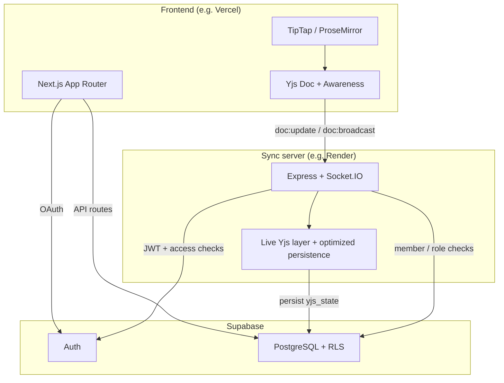
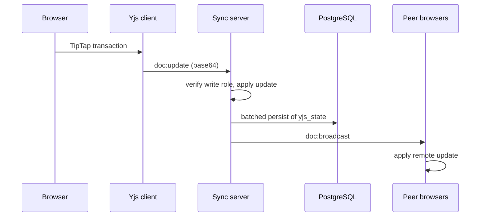

# Architecture & codebase tour

## How it works (contributor flows)

These paths are the fastest way to navigate the codebase.

### 1. Opening a document and connecting to live sync

1. User opens `/doc/[id]` (`apps/web/src/app/doc/[id]/page.tsx`).
2. The page uses **`useCollabEditor`** (`apps/web/src/hooks/useCollabEditor.ts`): creates a **`Y.Doc`** and **`Awareness`** (presence/cursors).
3. The hook opens a Socket.IO client to `NEXT_PUBLIC_SYNC_SERVER_URL`, passing the Supabase **`access_token`** in `auth.token`.
4. On **`connect`**, the client emits **`doc:join`** with the document id.
5. The sync server (`apps/sync-server/src/index.ts`) verifies the user in **`io.use`**, checks membership with **`assertDocumentAccess`**, joins the Socket.IO room, then:
   - Loads or creates the server-side Yjs doc via **`getOrCreateDoc`** (`apps/sync-server/src/yjsManager.ts`) — seeded from **`documents.yjs_state`** in Postgres if present.
   - Emits **`doc:load`** (full state as base64) to that client.
   - Sends **`awareness:sync`** so presence can align.
6. The client applies **`doc:load`** with `Y.applyUpdate(..., 'remote')` so TipTap stays in sync with the server’s canonical doc.

**Rejection path:** if the user cannot access the document, the server emits **`doc:rejected`**; the hook surfaces **`syncRejectMessage`** and stops treating the session as connected.

### 2. Typing and persisting the document body

1. TipTap edits mutate the shared **`Y.Doc`**.
2. Local Yjs updates (non-remote origin) are sent as **`doc:update`** with a base64-encoded update.
3. The server **`resolveSocketAccess`** requires a **write** role (`owner`, `admin`, `editor`), applies the update with **`Y.applyUpdate`**, **`schedulePersist`**, and broadcasts **`doc:broadcast`** to everyone else in the room.
4. **`schedulePersist`** batches writes on a short interval and persists **`documents.yjs_state`** via the Supabase service role (`yjsManager.ts`).

Comments, sharing, and version rows are **not** carried on this socket path; only the Yjs document state is.

### 3. Presence (cursors / who’s online)

1. Awareness changes from the local client emit **`awareness:update`**.
2. The server echoes **`awareness:diff`** to peers; **`applyAwarenessUpdate`** runs on the client.
3. Cursor colors are chosen in **`useCollabEditor`** using **`cursorColors.ts`**.

### 4. REST API vs realtime

| Concern | Where it lives |
| --- | --- |
| Document list, create, share, access requests, versions, comments | Next.js **Route Handlers** under `apps/web/src/app/api/` → Supabase (RLS + server checks). |
| Live body text + presence | **Yjs + Socket.IO** on `apps/sync-server`. |

Main editor UI: **`Editor.tsx`**. Comment UI and API: **`CommentsPanel.tsx`**, **`/api/documents/[id]/comments`**.

## System diagram



## Sequence: one edit propagates



## Tech stack

| Layer | Stack |
| --- | --- |
| App | Next.js 14, React 18, TypeScript, Tailwind |
| Editor | TipTap v2 (ProseMirror) |
| CRDT | Yjs |
| Realtime transport | Socket.IO |
| Data & auth | Supabase (Postgres, Auth, RLS) |
| Monorepo | npm workspaces (`apps/web`, `apps/sync-server`) |

## Repository layout

```plaintext
.
├── package.json                 # npm workspaces; scripts: dev:web, dev:server, dev:all, build:*
├── package-lock.json
├── README.md
├── vercel.json
├── .env.example
├── apps/
│   ├── web/                     # Next.js 14 frontend
│   └── sync-server/             # Socket.IO + Yjs
└── supabase/
    ├── schema.sql
    └── patches/
```

(Full tree with file names lives in the repo; this is the structural spine.)

---

| [← Previous: Getting started](getting-started.md) | [Handbook (root README)](../README.md#documentation-handbook) | [Next: API overview →](api-overview.md) |
