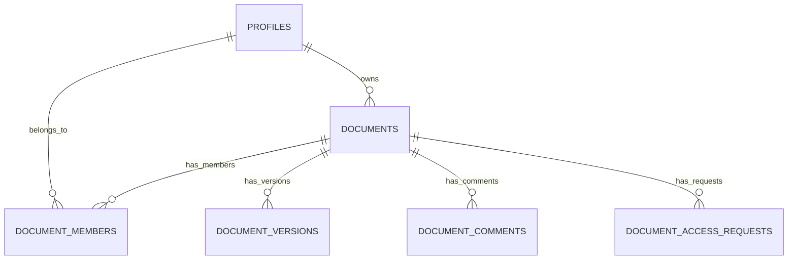

# Data model & roles

## Database

Core tables: `profiles`, `documents` (includes `yjs_state`), `document_members`, `document_versions`, `document_comments`, `document_access_requests`.

**RLS:** Policies on `documents` and `document_members` must not recurse. This repo uses **`SECURITY DEFINER`** helpers in `schema.sql` (e.g. `is_document_member`, `is_document_owner`) to break cycles.

## Role-based access

Roles are stored in Postgres as enum **`app_role`** on `document_members` (`viewer`, `commenter`, `editor`, `admin`, `owner`). The **document owner** is always `documents.owner_id`; they are not required to have a row in `document_members`, but the app may upsert an `owner` row for consistency.

### What each role can do

**Precedence:** On a document, **owner outranks admin**. The owner can **change or revoke any admin** (or any member) from Share; an admin **cannot** modify or remove the owner. Admins otherwise mirror the owner’s sharing powers for everyone who is not the owner.

| Capability | owner | admin | editor | commenter | viewer |
| --- | --- | --- | --- | --- | --- |
| **Precedence** (1 = highest authority) | **1** | **2** | 3 | 4 | 5 |
| Edit document body (live sync) | ✓ | ✓ | ✓ | | |
| Live presence (see who’s online) | ✓ | ✓ | ✓ | ✓ | ✓ |
| Comments: add | ✓ | ✓ | ✓ | ✓ | |
| Comments: resolve / moderate | ✓ | ✓ | ✓ | | |
| Comments: read | ✓ | ✓ | ✓ | ✓ | ✓ |
| **Share:** invite users, change roles, revoke (not the owner) | ✓ | ✓ | | | |
| **Access requests:** approve or decline pending requests | ✓ | ✓ | | | |
| Request a role or access (if not owner) | | | ✓ | ✓ | ✓ |

**Owner-only:** rename the document (title), delete the document, and **cannot** be removed or have their role changed via sharing—the owner row is fixed in the UI and API.

**Admin vs owner:** Admins have the same **sharing and approval** powers as the owner for everyone **except** the owner account. Only the owner can transfer true ownership (not implemented as a separate action here—the owner remains `documents.owner_id`). Admins can assign or revoke **admin** for **other** members (not the owner). The **owner** always has final say: they can demote or revoke **any** admin, or change any role, because owner precedence is strictly above admin.

**Viewer / commenter / editor:** They **cannot** open Share or approve requests. They **can** request access or a **role change** (viewer, commenter, editor, admin); those requests appear in the **editor notifications** (bell) for **both the owner and every admin** on that document, who can approve or decline.

### Where this is enforced

- **HTTP:** `apps/web/src/app/api/documents/[id]/share/route.ts` — invite and role changes require **owner or admin** (`assertOwnerOrAdmin`). Targeting the document owner’s user id is rejected.
- **HTTP:** `apps/web/src/app/api/documents/[id]/access/route.ts` — `GET` returns `pendingRequests` and `canModerateAccessRequests` for **owner and admin**; `PATCH` (approve/reject) allows **owner or admin**.
- **Realtime:** `apps/sync-server` — live edits require a **write** role: `owner`, `admin`, or `editor` (`assertDocumentWriteAccess`).

If your database was created before `admin` existed on `app_role`, run `supabase/patches/ensure_app_role_admin.sql` once in the Supabase SQL Editor.

---

| [← Previous: Sync server reference](sync-server-api.md) | [Handbook (root README)](../README.md#documentation-handbook) | [Next: Security & operations →](security-and-operations.md) |
